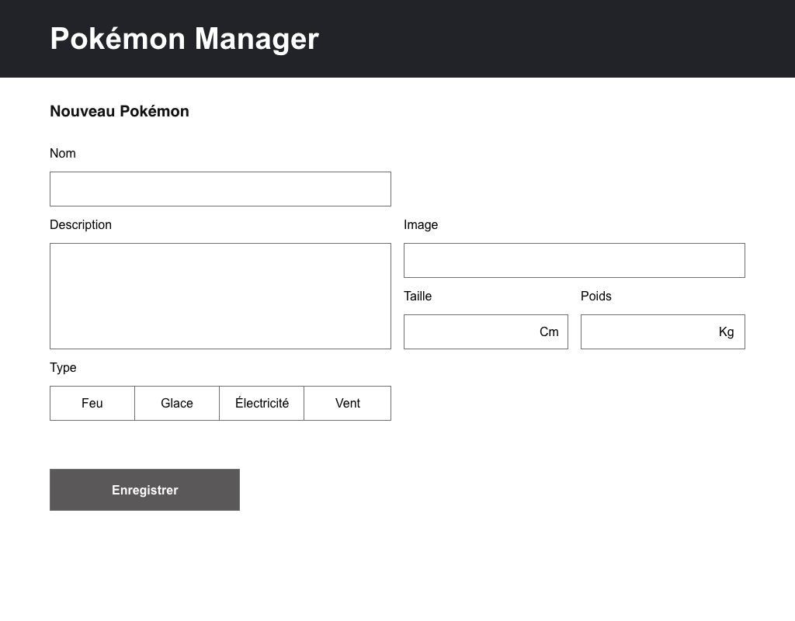

# Pokemon Manager exercise

## Instructions
In order to speed up the test you should start with this repository.

Your task is to create a small application with 2 pages.
- A Home page which display a list of pokemons.
- A Form page to add a new pokemon.

A pokemon has the following properties :

`name`: text\
`description`: text\
`imageUrl`: link\
`size`: number\
`weight`: number\
`type`: 'electricity' / 'fire' / 'ice' / 'wind'

You can also check examples in `json-server/db.json`

### Recommendations
- Main constraints are to use react / typescript, create 2 routes with a functional form and a list of pokemons. Beside that, you are free to add plugins and develop as you like.
- For the "backend" part, a "json-server" is provided, see the `npm run server` script below.
- For UI/UX, you can inspire from prototypes below but it's not mandatory, as long as the interface is user-friendly.

Good luck !

## Models / prototypes

Located in the `/prototype` folder

### Home page 

### Form Page

This project was bootstrapped with [Create React App](https://github.com/facebook/create-react-app).

## Available Scripts

In the project directory, you can run:

### `npm start`

Runs the app in the development mode.\
Open [http://localhost:3000](http://localhost:3000) to view it in the browser.

### `npm run server`

Launches a json-server on port 3001.\
Get [http://localhost:3001/pokemons](http://localhost:3001/pokemons) to view json database.\
Make a POST request on http://localhost:3001/pokemons with a Content-Type: application/json header 
and a proper body content in order to add a pokemon.\
All data are stored in the `json-server/db.json` file\
[More on json-server](https://github.com/typicode/json-server)

### `npm test`

Launches the test runner in the interactive watch mode.\
See the section about [running tests](https://facebook.github.io/create-react-app/docs/running-tests) for more information.

## Learn More

You can learn more in the [Create React App documentation](https://facebook.github.io/create-react-app/docs/getting-started).

To learn React, check out the [React documentation](https://reactjs.org/).
